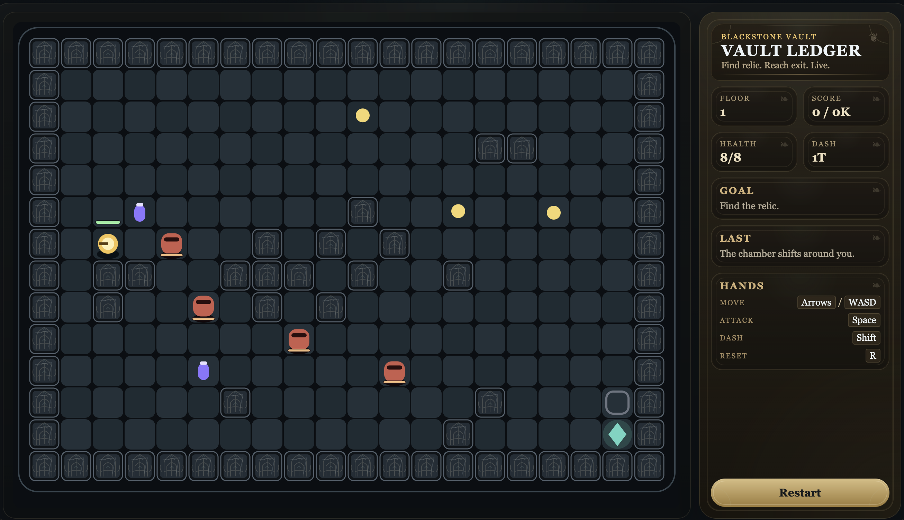

# Vault Delver App

This is a desktop-ready rebuild of the dungeon crawler using plain HTML5 Canvas and JavaScript.



## Why this layout

- Local testing on macOS is immediate with a browser and a tiny built-in Node server.
- The game code is framework-free, so iteration is fast and the frontend stays portable.
- A `src-tauri/` wrapper is already included so later you can package native desktop builds for Windows and macOS.

## Local development on macOS

From this folder:

```bash
npm run dev
```

Then open:

```text
http://127.0.0.1:4173
```

## Run as a native desktop app on macOS

From this folder:

```bash
npm run tauri:dev
```

## Build desktop packages later

```bash
npm run tauri:build
```

## Create The GitHub Repo

From this folder, create the repo under `dylowens/moria_dungeon` and push the current app:

```bash
git init
git checkout -b main
git add .
git commit -m "Initial Moria Dungeon app"
gh auth login
gh repo create dylowens/moria_dungeon --public --source=. --remote=origin --push
```

If the repo already exists, use:

```bash
git init
git checkout -b main
git add .
git commit -m "Initial Moria Dungeon app"
git remote add origin git@github.com:dylowens/moria_dungeon.git
git push -u origin main
```

## Publish Downloadable Builds To GitHub Releases

The release workflow lives at [.github/workflows/release.yml](/Users/dylanimal/Documents/Eco_Games/vault_delver_app/.github/workflows/release.yml).

Push a version tag:

```bash
git tag v0.1.0
git push origin main
git push origin v0.1.0
```

That triggers GitHub Actions to build:

- a Windows NSIS installer `.exe`
- a macOS `.dmg`

The generated files are uploaded to the matching GitHub Release automatically.

## Tests

```bash
npm test
```

## Build static web assets

```bash
npm run build
```

This copies `web/` to `dist/`, which is the folder Tauri will package for desktop builds.

## Future desktop packaging

The Tauri wrapper is configured in [src-tauri/tauri.conf.json](/Users/dylanimal/Documents/Eco_Games/vault_delver_app/src-tauri/tauri.conf.json).

Recommended next steps before shipping:

1. Add app icons with the Tauri icon generator.
2. Set up code signing for Windows and macOS.
3. Store signing secrets in GitHub Actions before turning on public releases.

Typical commands later:

```bash
npm run build
cargo tauri dev
cargo tauri build
```

Notes:

- Build the macOS `.dmg` on macOS.
- Build the Windows `.exe` installer on Windows or on CI configured for Windows packaging.
- A draft cross-platform release workflow is included at [.github/workflows/release.yml](/Users/dylanimal/Documents/Eco_Games/vault_delver_app/.github/workflows/release.yml).
- Tauri documents `.dmg` bundling on macOS and NSIS Windows installer output for Windows releases:
  [Create a Project](https://v2.tauri.app/start/create-project/)
  [DMG](https://v2.tauri.app/distribute/dmg/)
  [Windows Installer](https://v2.tauri.app/distribute/windows-installer/)
